# 🎬 Movie Analytics

### Data Quality · Data Modelling · Statistical Analysis · Interactive Power BI Dashboard

<p align="center">
  
  
  
  
  
</p>

<p align="center">
  <a href="https://colab.research.google.com/github/koffifidelek59-collab/movie-analytics/blob/main/Movie-Analytics.ipynb">
    
  </a>
</p>

<p align="center">
  <strong>What drives the success of a film? A data pipeline, statistical tests and a seven-page Power BI dashboard on 3,754 TMDB films.</strong>
</p>

<p align="center">
  <a href="report.pdf">Report (PDF)</a> ·
  <a href="Movie-Analytics.ipynb">Notebook</a> ·
  <a href="powerbi/Movie_Analytics_Dashboard.pbix">Dashboard (.pbix)</a> ·
  <a href="powerbi/Dashboard_Build_Guide.md">Build guide</a>
</p>

<p align="center">
  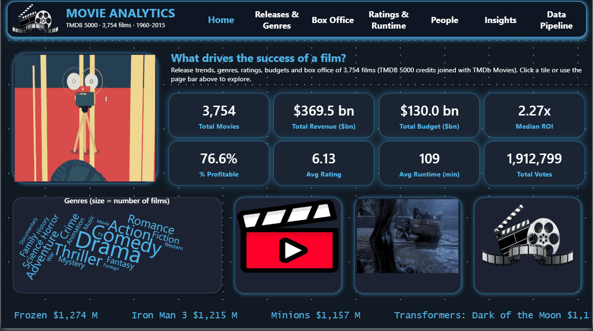
</p>

---

## 📊 Project Snapshot

|                                  |                 |
| -------------------------------- | --------------: |
| **Films supplied (Source 1)**    |           4,803 |
| **Films in the enrichment (Source 2)** |    10,865 |
| **Films analysed (matched)**     |       **3,754** |
| **Match rate**                   |       **78.2%** |
| **Films with known budget and revenue** |    2,805 |
| **Film–genre pairs**             | 9,939 (20 genres) |
| **Total revenue**                |   **$369.5 bn** |
| **Total budget**                 |   **$130.0 bn** |
| **Median ROI**                   |       **2.27x** |
| **Profitable films**             |       **76.6%** |
| **Average rating**               |      **6.13 / 10** |
| **Average runtime**              |     **109 min** |

**Release years covered:** 1960 – 2015

---

## 🎯 Overview

**Movie Analytics** is an end-to-end analysis of film success, built with **Python** and **Power BI**.

The project turns two raw TMDb files into a validated analytical model combining:

* Data quality audit and cleaning
* Feature engineering and a star-like data model
* KPI development with explicit bases
* Non-parametric statistical analysis
* A seven-page interactive dashboard
* Evidence-based insights and recommendations

The central question is simple:

> **What is related to the success of a film, and how can it be measured reliably?**

### Two faces of success

| Face of success    | Indicator                                              | Base                                  |
| ------------------ | ------------------------------------------------------ | ------------------------------------- |
| **Commercial**     | Worldwide revenue, profit, ROI (revenue / budget)      | Films with known budget and revenue   |
| **Critical**       | Average rating, vote count, weighted rating            | All films                             |
| **Volume**         | Number of films released                               | All films                             |
| **Format**         | Runtime, genre                                         | All films                             |

### Requirement map

| #   | Requirement of the brief                         | Notebook section | Dashboard page                 |
| --- | ------------------------------------------------ | ---------------: | ------------------------------ |
| R1  | Movies released over the years                   |              9.1 | Releases & Genres              |
| R2  | Movies by genre                                  |              9.2 | Releases & Genres              |
| R3  | Average rating across genres                     |              9.3 | Releases & Genres              |
| R4  | Relationship between budget and revenue          |              9.4 | Box Office                     |
| R5  | Highest-grossing movies                          |              9.5 | Box Office                     |
| R6  | Highest-rated movies, considering the vote count |              9.6 | Ratings & Runtime              |
| R7  | Revenue and ratings over the years               |              9.7 | Box Office / Ratings & Runtime |
| R8  | Runtime versus ratings and revenue               |              9.8 | Ratings & Runtime              |
| R9  | Relevant KPIs                                    |                8 | Home                           |
| R10 | Interactive dashboard with charts and slicers    |               11 | All pages                      |
| R11 | Main insights and trends                         |               12 | Insights                       |

---

## 🔄 Analytical Workflow

```text
Two raw TMDb files
        ↓
Data Quality Audit (6 checks)
        ↓
Join on the TMDb identifier
        ↓
Cleaning: zeros become missing values
        ↓
Feature Engineering (ROI, weighted rating, runtime class ...)
        ↓
Data Model: 1 fact table + 3 bridge tables
        ↓
KPI Engineering (Python and DAX)
        ↓
Statistical Analysis (Spearman, Kruskal-Wallis, Mann-Whitney)
        ↓
Insight Generation
        ↓
Interactive Power BI Dashboard
```

<p align="center">
  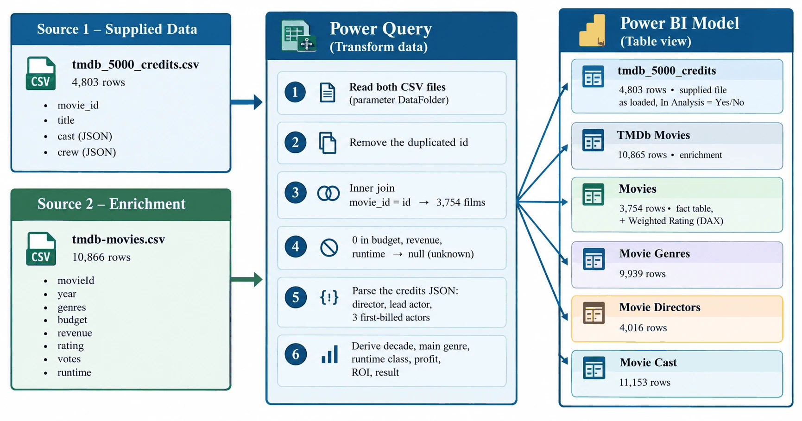
</p>

---

# 🧹 Data Quality & Preparation

The analysis starts from two sources sharing the same TMDb identifier. A structured audit of **six checks** was performed before any analysis.

### Data-quality findings

| Check                     | Finding                                                                 | Treatment                                              |
| ------------------------- | ----------------------------------------------------------------------- | ------------------------------------------------------ |
| Duplicates                | 0 in the supplied file; **1 exact duplicate** in the enrichment         | Duplicate row removed                                  |
| Join coverage             | **3,754 of 4,803** films matched (78.2%); titles identical for 98.3%    | Inner join; unmatched films are mostly 2016 releases   |
| Zeros used as "unknown"   | Budget = 0: **564** films · Revenue = 0: **828** · Runtime = 0: **2**   | Replaced by missing values                             |
| Rating reliability        | **847 films (22.6%)** rated by fewer than 50 users; median 186 votes    | Vote-weighted rating                                   |
| Runtime outliers          | Longest films are genuine (*Carlos*, 338 min)                           | Kept                                                   |
| Text encoding             | **134** enrichment titles with broken accents                           | Title taken from the supplied file, correctly encoded  |

After validation:

> **3,754 films remain in the analytical dataset, 2,805 of them with both budget and revenue known.**

### Why a naive reading misleads

* **Zeros are unknown values.** Averaging them as real zeros would lower every financial figure and invent hundreds of "flops".
* **A dollar of 1977 is not a dollar of 2015.** Trends use the inflation-adjusted columns (2010 dollars).
* **A high rating with few votes is fragile.** Quality is ranked with a vote-weighted score.
* **A film has several genres.** Genre counts add up to 9,939 pairs, not to 3,754 films.

---

## 🧮 Engineered Variables

The cleaned `movies` table (one row per film, 27 columns) introduces variables designed for the analysis:

* `release_month`, `decade`
* `main_genre` (first genre listed)
* `runtime_class` (< 90, 90-105, 105-120, 120-150, > 150 min)
* `profit`, `roi`, `profitable`, `has_financials`
* `weighted_rating`
* `director`, `lead_actor`, `cast_size`, `crew_size` (parsed from the JSON credits)

### Weighted rating

Ranking by raw average rating favours films with a handful of votes. The project uses the IMDb Bayesian formula:

```text
WR = v / (v + m) × R  +  m / (v + m) × C

R = film rating            v = its vote count
C = mean rating of all films = 6.13
m = 90th percentile of vote counts = 1,354
```

---

## 🧱 Data Model

The cleaning produces **one fact table** and **three bridge tables**, imported into Power BI.

```text
 movie_genres ──┐
 (movie_id,     │
  genre)        │        ┌──────────────────┐
                ├────────┤      movies      ├──────── movie_cast
 movie_directors┤        │  (1 row / film)  │         (movie_id, actor,
 (movie_id,     │        │   key: movie_id  │          billing_order)
  director)     ┘        └──────────────────┘
```

| Table             |  Rows | Grain                      |
| ----------------- | ----: | -------------------------- |
| `movies`          | 3,754 | One row per film           |
| `movie_genres`    | 9,939 | One row per film and genre |
| `movie_cast`      | 18,708 | Five first-billed actors per film |
| `movie_directors` | 4,016 | One row per film and director |

---

# 📈 Key Performance Indicators

Every KPI states its base.

| KPI                | Value        | Base                                  | DAX                            |
| ------------------ | -----------: | ------------------------------------- | ------------------------------ |
| Movies             |    **3,754** | All matched films                     | `COUNTROWS(movies)`            |
| Total revenue      | **$369.5 bn** | Films with known revenue             | `SUM(movies[revenue])`         |
| Total budget       | **$130.0 bn** | Films with known budget              | `SUM(movies[budget])`          |
| Median ROI         |    **2.27x** | Films with known budget and revenue   | `MEDIAN(movies[roi])`          |
| Profitable films   |    **76.6%** | Films with known budget and revenue   | Share of profit > 0            |
| Average rating     |  **6.13 / 10** | All films                           | `AVERAGE(movies[vote_average])` |
| Average runtime    |   **109 min** | Films with known runtime             | `AVERAGE(movies[runtime])`     |

These figures describe the commercial cinema of the dataset: films with known financials are mostly larger, better-documented productions.

---

# 🔎 Key Insights

### 01 · Production exploded after 2000

**72%** of the films were released after 2000, at **150–200 films a year**.

---

### 02 · Drama, Comedy, Thriller and Action dominate

Drama (1,742 films), Comedy (1,405), Thriller (1,112) and Action (1,010) lead the catalogue. A film carries **2.65 genres** on average.

---

### 03 · Genre shapes the rating

Among genres with at least 50 films, mean rating ranges from **5.66 (Horror)** to **6.38 (Drama)**. Documentary (6.73), War and History lead overall.

Kruskal-Wallis: H = 625.7, p < 0.001.

---

### 04 · Money buys revenue, not acclaim

| Pair                  |    n | Spearman ρ | Strength   |
| --------------------- | ---: | ---------: | ---------- |
| Budget vs revenue     | 2,805 |   **0.65** | Strong     |
| Budget vs rating      | 2,805 |  **-0.08** | Negligible |

---

### 05 · The typical film is profitable

Median ROI is **2.27x** and **76.6%** of films with known financials recover their budget; one in four does not.

| Budget class | Films | Median revenue | Median ROI | Profitable |
| ------------ | ----: | -------------: | ---------: | ---------: |
| < $10M       |   568 |        $13.9 M |      3.39x |      75.7% |
| $10–30M      |   926 |        $41.8 M |      2.17x |      74.3% |
| $30–70M      |   793 |        $95.0 M |      1.98x |      74.7% |
| $70–150M     |   424 |       $237.5 M |      2.29x |      82.3% |
| > $150M      |    94 |       $554.9 M |      2.85x |  **94.7%** |

---

### 06 · Franchise blockbusters rule the box office

| Film             | Year | Revenue    |   ROI |
| ---------------- | ---: | ---------: | ----: |
| Avatar           | 2009 | $2.78 bn   | 11.7x |
| Titanic          | 1997 | $1.85 bn   |  9.2x |
| The Avengers     | 2012 | $1.52 bn   |  6.9x |
| Jurassic World   | 2015 | $1.51 bn   | 10.1x |
| Furious 7        | 2015 | $1.51 bn   |  7.9x |

---

### 07 · The best films are widely seen

Ranked by weighted rating, the top films all have thousands of votes.

| Film                     | Year | Average rating | Votes | Weighted rating |
| ------------------------ | ---: | -------------: | ----: | --------------: |
| The Shawshank Redemption | 1994 |            8.4 | 5,754 |        **7.97** |
| The Dark Knight          | 2008 |            8.1 | 8,432 |        **7.83** |
| The Godfather            | 1972 |            8.3 | 3,970 |        **7.75** |

---

### 08 · Trends over time

In inflation-adjusted dollars, the typical film is **not richer than thirty years ago**, and average ratings drift down slightly over time (survivorship of old classics).

---

### 09 · Longer films are better rated and earn more

| Runtime class | Films | Average rating | Median revenue |
| ------------- | ----: | -------------: | -------------: |
| < 90 min      |   562 |       **5.69** |       $44.5 M  |
| 90–105 min    |  1,379 |          5.93 |       $44.8 M  |
| 105–120 min   |   983 |          6.24 |       $65.8 M  |
| 120–150 min   |   695 |          6.56 |      $115.2 M  |
| > 150 min     |   133 |       **6.93** |      $134.8 M  |

This is an association driven by the type of film, not a rule.

---

### 10 · A few directors concentrate the box office

| Director          | Films | Total revenue | Average rating |
| ----------------- | ----: | ------------: | -------------: |
| Steven Spielberg  |    26 |     $8.96 bn  |           6.85 |
| Peter Jackson     |     9 |     $6.49 bn  |           7.19 |
| James Cameron     |     7 |     $5.82 bn  |           7.16 |
| Michael Bay       |    11 |     $4.92 bn  |           6.33 |
| Christopher Nolan |     8 |     $4.17 bn  |       **7.64** |

Nolan combines box-office revenue with the best average rating of the group.

---

# 🧪 Statistical Analysis

Ratings, revenues and budgets are skewed, so the tests are **non-parametric**.

| Question                                | Method                       | Result                                  |
| --------------------------------------- | ---------------------------- | --------------------------------------- |
| Link between two numeric variables      | Spearman rank correlation    | See table below                         |
| Does rating differ across genres?       | Kruskal-Wallis               | H = 625.7, p < 0.001                    |
| Does rating differ across runtime classes? | Kruskal-Wallis            | H = 556.9, p < 0.001                    |
| Drama versus Horror                     | Mann-Whitney U               | U = 566,816, p < 0.001                  |

### Rank correlations

| Pair                         |     n | Spearman ρ | Strength   |
| ---------------------------- | ----: | ---------: | ---------- |
| Budget vs revenue            | 2,805 |   **0.65** | Strong     |
| Vote count vs rating         | 3,754 |       0.39 | Moderate   |
| Runtime vs rating            | 3,752 |       0.38 | Moderate   |
| Runtime vs revenue           | 2,805 |       0.25 | Weak       |
| Rating vs revenue            | 2,805 |       0.19 | Weak       |
| Release year vs rating       | 3,754 |      -0.09 | Negligible |
| Budget vs rating             | 2,805 |      -0.08 | Negligible |

With 2,800 to 3,750 films, even small correlations are "significant": the **strength** column, not the p-value, says what matters.

---

# 📉 Analysis Figures

<p align="center">
  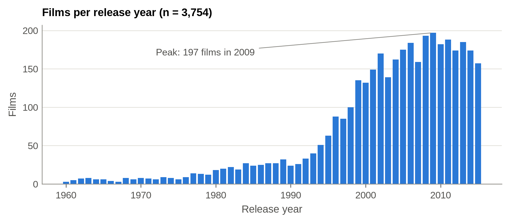
  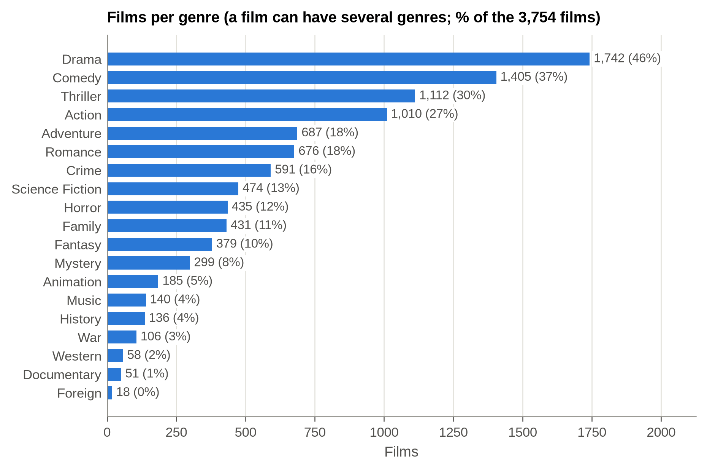
</p>
<p align="center">
  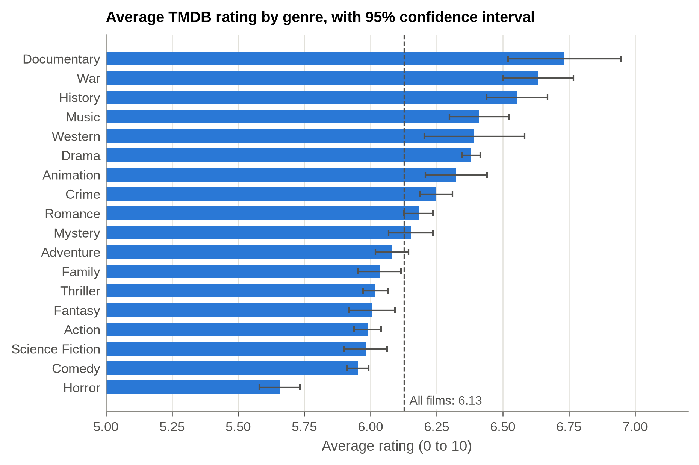
  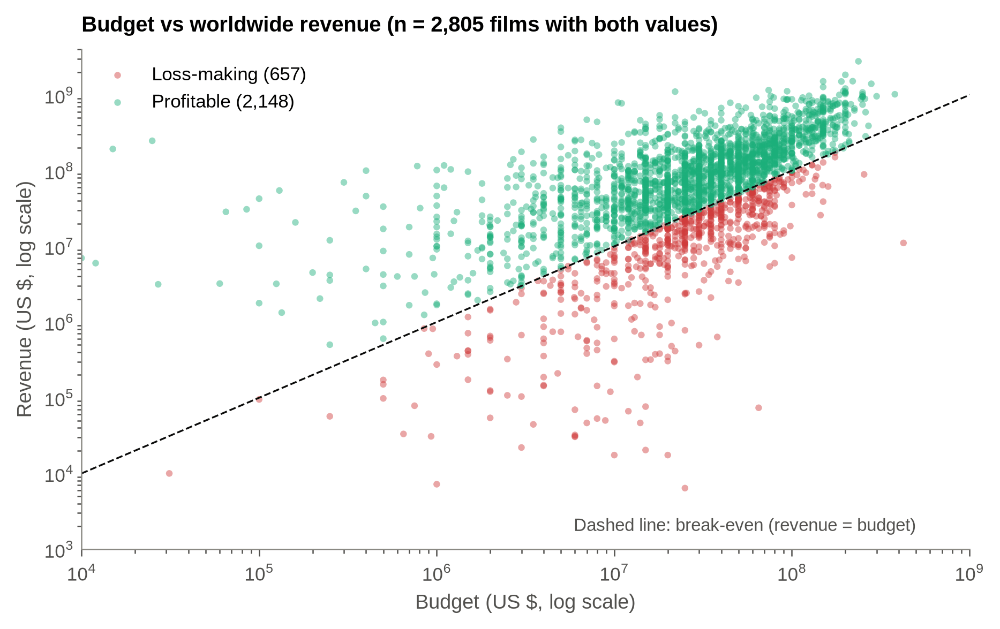
</p>
<p align="center">
  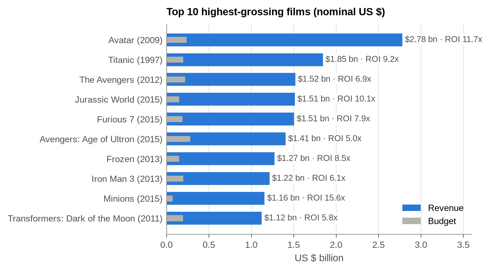
  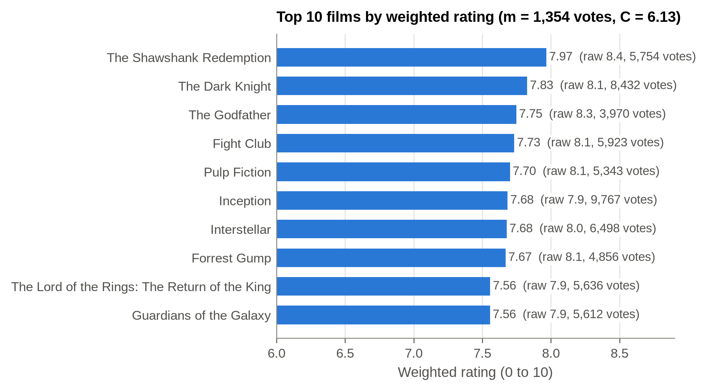
</p>
<p align="center">
  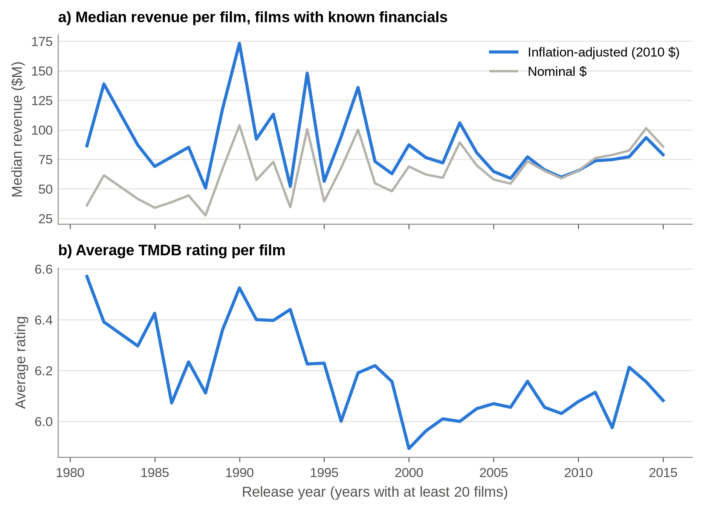
  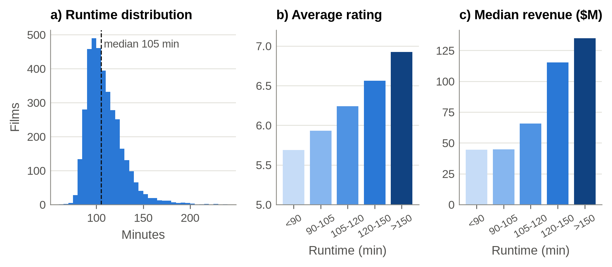
</p>
<p align="center">
  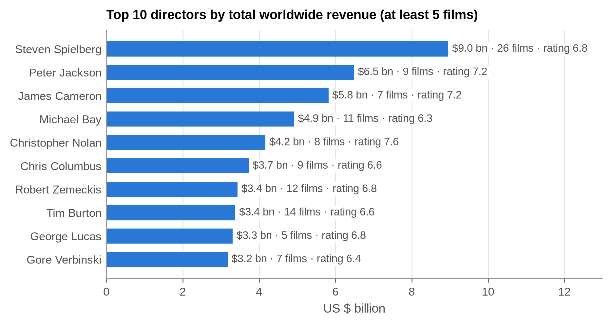
</p>

---

# 🖥️ Interactive Power BI Dashboard

The dashboard provides:

* **7 pages**
* **8 KPI cards** on the home page
* **4 synchronised slicers** (release year, genre, runtime class, financial result)
* **Top N filters**, a page navigator and clickable tiles
* **22 DAX measures** and one calculated column

| Page                  | Visuals                                                                                                   |
| --------------------- | --------------------------------------------------------------------------------------------------------- |
| **Home**              | 8 KPI cards, word cloud of genres, tiles to the analysis pages, scrolling top-grossing titles             |
| **Releases & Genres** | Films per year, films by genre, average rating by genre and by decade                                     |
| **Box Office**        | Budget vs revenue scatter with trend line, Top 10 grossing, median adjusted revenue per year, median ROI by main genre |
| **Ratings & Runtime** | Top 10 by weighted rating, rating gauge, rating and median revenue by runtime class, average rating per year |
| **People**            | Top 10 directors by revenue, top 10 actors by number of films, best directors by weighted score (3+ films) |
| **Insights**          | The ten insights                                                                                          |
| **Data Pipeline**     | Supplied file as loaded: films, films analysed, match rate, cast and crew entries                         |

<table align="center">
  <tr>
    <td align="center">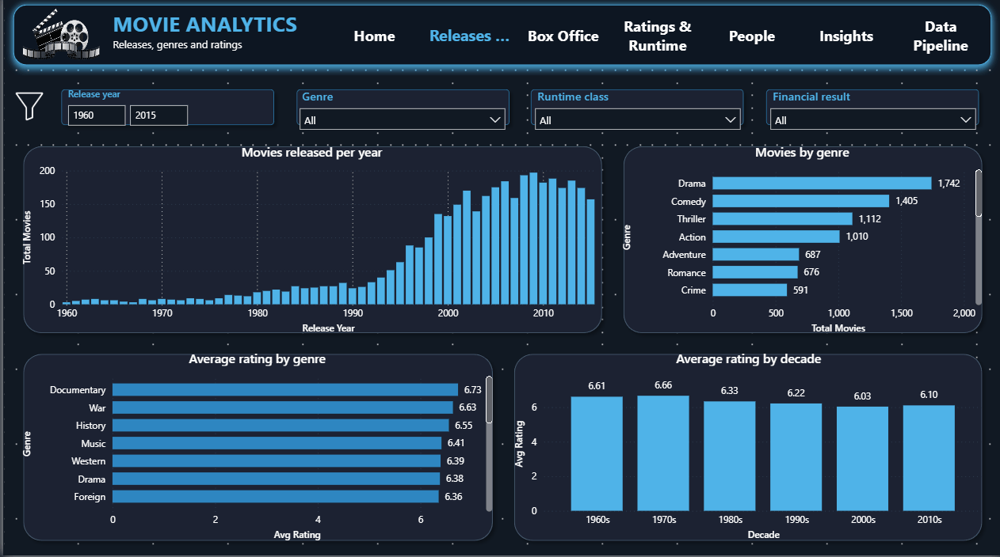<br><b>Releases & Genres</b></td>
    <td align="center">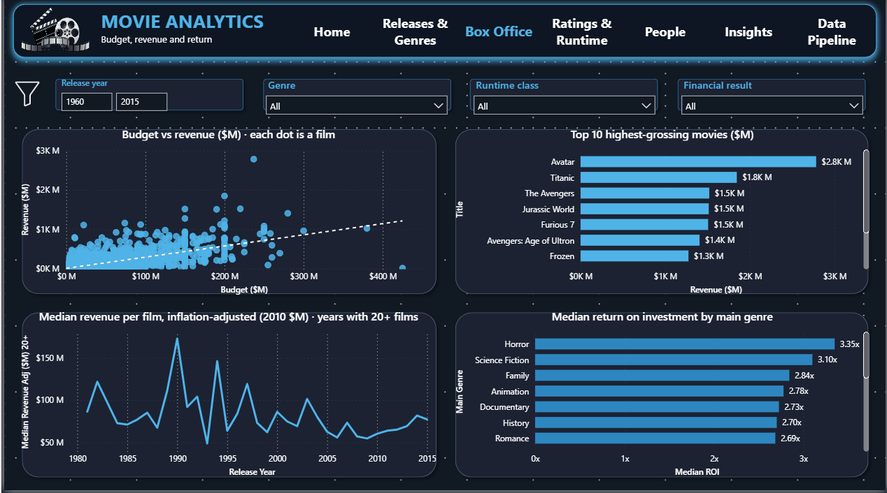<br><b>Box Office</b></td>
  </tr>
  <tr>
    <td align="center">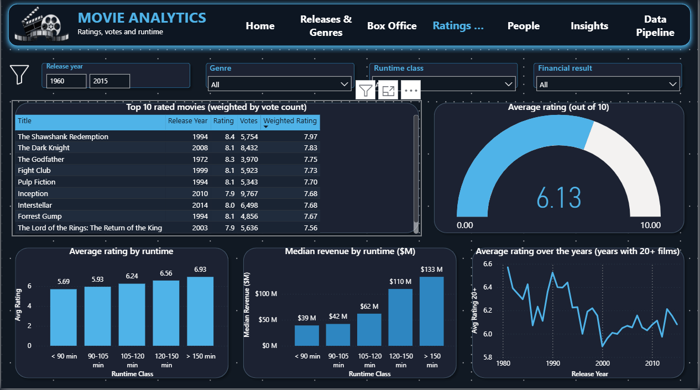<br><b>Ratings & Runtime</b></td>
    <td align="center">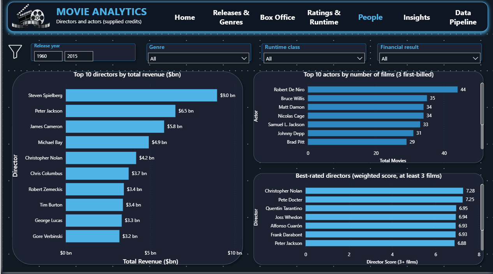<br><b>People</b></td>
  </tr>
  <tr>
    <td align="center">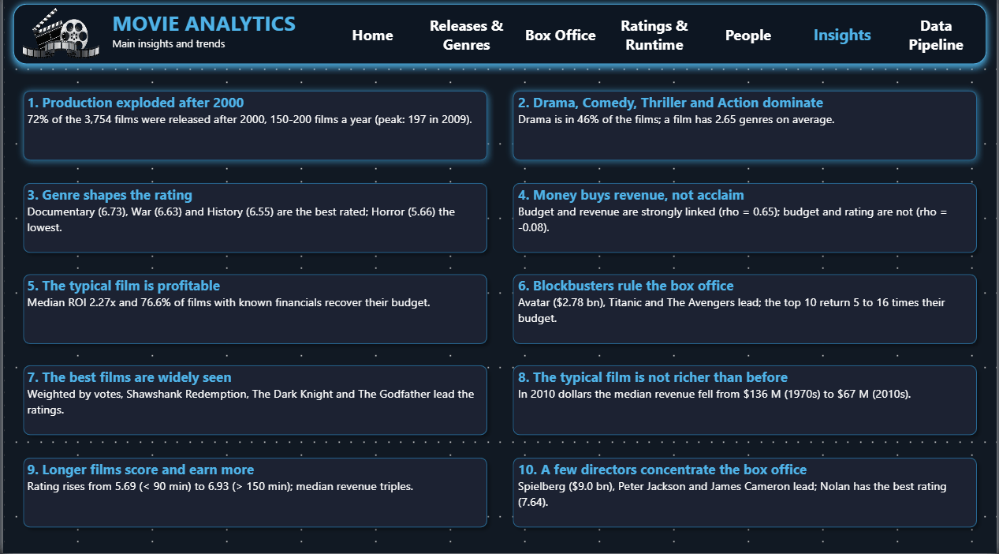<br><b>Insights</b></td>
    <td align="center">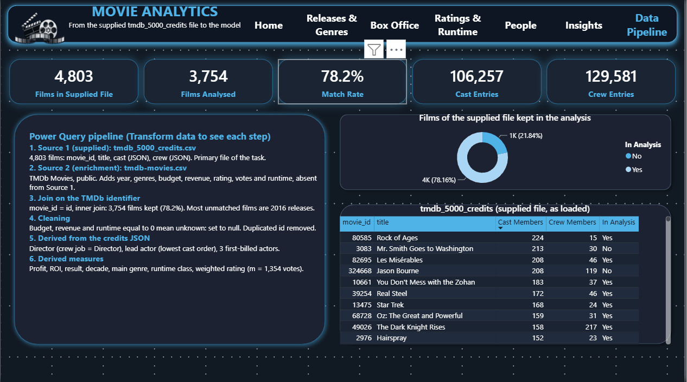<br><b>Data Pipeline</b></td>
  </tr>
</table>

---

## ⚙️ Power Query & DAX

All preparation runs in **Power Query (M)**; the full code is in [`PowerQuery_pipeline.m`](powerbi/PowerQuery_pipeline.m).

| Query                | Loaded    | Role                                                                    |
| -------------------- | --------- | ----------------------------------------------------------------------- |
| `DataFolder`         | Parameter | Folder holding the two source CSV files                                 |
| `Credits Raw`        | No        | Reads Source 1, the supplied credits file                               |
| `TMDb Movies Raw`    | No        | Reads Source 2; removes the duplicated identifier                       |
| `tmdb_5000_credits`  | Yes       | Supplied file as received, with an `In Analysis` flag                   |
| `TMDb Movies`        | Yes       | The enrichment                                                          |
| `Movies`             | Yes       | Inner join, zeros to null, JSON parsing, derived columns                |
| `Movie Genres`       | Yes       | One row per film and genre                                              |
| `Movie Directors`    | Yes       | Crew members with job = Director                                        |
| `Movie Cast`         | Yes       | First-billed cast members                                               |

### Model relationships

| Relationship                                   | Cardinality | Cross filter |
| ---------------------------------------------- | ----------- | ------------ |
| `Movie Genres[Movie ID]` → `Movies[Movie ID]`     | Many to one | Both   |
| `Movie Directors[Movie ID]` → `Movies[Movie ID]`  | Many to one | Both   |
| `Movie Cast[Movie ID]` → `Movies[Movie ID]`       | Many to one | Both   |
| `Movies[Movie ID]` → `tmdb_5000_credits[movie_id]` | Many to one | Single |
| `Movies[Movie ID]` → `TMDb Movies[id]`            | Many to one | Single |

### Weighted rating in DAX

```dax
Weighted Rating =
    VAR C = CALCULATE ( AVERAGE ( Movies[Rating] ), ALL ( Movies ) )
    VAR m = CALCULATE ( PERCENTILE.INC ( Movies[Votes], 0.9 ), ALL ( Movies ) )
    RETURN DIVIDE ( Movies[Votes], Movies[Votes] + m ) * Movies[Rating]
         + DIVIDE ( m, Movies[Votes] + m ) * C
```

All measures are documented in [`DAX_measures.dax`](powerbi/DAX_measures.dax).

---

# 📁 Repository Architecture

```text
movie-analytics/
│
├── Movie-Analytics.ipynb            # Analysis notebook, point by point (< 1 min on a CPU)
├── report.pdf                       # 19-page report with dashboard captures
├── report.tex                       # LaTeX source of the report
│
├── data/
│   ├── raw/
│   │   ├── tmdb_5000_credits.csv    # Source 1, supplied: 4,803 films, cast and crew
│   │   └── tmdb-movies.csv          # Source 2: year, genres, budget, revenue, rating, runtime
│   └── powerbi/
│       ├── movies.csv               # One row per film (3,754)
│       ├── movie_genres.csv         # Film-genre pairs
│       ├── movie_cast.csv           # Film-actor pairs
│       └── movie_directors.csv      # Film-director pairs
│
├── powerbi/
│   ├── Movie_Analytics_Dashboard.pbix   # Dashboard, data loaded: opens directly
│   ├── Movie_Analytics_Dashboard.pbit   # Template, reloads data/raw/
│   ├── PowerQuery_pipeline.m            # Power Query (M) code
│   ├── DAX_measures.dax                 # 22 measures and the weighted-rating column
│   ├── Dashboard_Build_Guide.md         # How to open, check and adjust the dashboard
│   └── movie_theme.json                 # Colour theme
│
├── figures/                         # fig01 to fig10
│   └── dashboard/                   # Captures of the 7 dashboard pages
│
├── results/                         # KPI and result tables (CSV)
├── LICENSE
└── README.md
```

---

# 🛠️ Techniques

### Python

* `pandas`: joins, JSON parsing, `explode`, `pd.cut`, aggregations
* `scipy.stats`: `spearmanr`, `kruskal`, `mannwhitneyu`
* `matplotlib`: analysis figures (300 dpi)

### Power BI

* Power Query (M): parameters, merges, JSON expansion, staging queries
* DAX: measures, calculated column, percentile-based weighted rating
* Star-like model with bidirectional filters on bridge tables
* Synchronised slicers, Top N filters, custom visuals (WordCloud, Scroller)

### Documentation

* Jupyter notebook mapped to the requirements R1–R11
* LaTeX report

---

# 🚀 How to Explore

### 1. Read the report

Open [`report.pdf`](report.pdf) for the full analysis.

### 2. Run the notebook

**Google Colab:** click the badge at the top, then *Runtime → Run all*. Missing data files are downloaded from this repository.

**Locally:**

```bash
git clone https://github.com/koffifidelek59-collab/movie-analytics.git
cd movie-analytics
pip install pandas numpy scipy matplotlib jupyter
jupyter notebook Movie-Analytics.ipynb
```

The notebook regenerates `data/powerbi/`, `figures/` and `results/`.

### 3. Open the dashboard

**Quick view:** double-click `powerbi\Movie_Analytics_Dashboard.pbix` in Power BI Desktop. The seven pages open with the data already loaded.

**Rebuild from the source files:**

1. Clone or download the repository (for example into `C:\movie-analytics\`).
2. Double-click `powerbi\Movie_Analytics_Dashboard.pbit`.
3. In the **DataFolder** window, give the full path of `data\raw\`, ending with a backslash, then **Load**.
4. If asked about privacy levels, choose **Organizational** for both files, and accept the custom visuals (WordCloud, Scroller).
5. Check the page **Data Pipeline**: 4,803 films supplied, 3,754 analysed (78.2%).

Details are in [`Dashboard_Build_Guide.md`](powerbi/Dashboard_Build_Guide.md).

---

# 📄 Documentation

| File                                     | Description                              |
| ---------------------------------------- | ---------------------------------------- |
| `report.pdf`                             | 19-page analytical report                |
| `report.tex`                             | LaTeX source                             |
| `Movie-Analytics.ipynb`                  | Complete analysis notebook               |
| `powerbi/Movie_Analytics_Dashboard.pbix` | Power BI dashboard                       |
| `powerbi/Dashboard_Build_Guide.md`       | Pipeline, model, pages and expected values |

---

# 🗂️ Data Sources

* **Source 1, supplied:** `tmdb_5000_credits.csv`, from the Kaggle *TMDB 5000 Movie Dataset*, unchanged. It defines the 4,803 films studied and provides titles, cast and crew (JSON).
* **Source 2, enrichment:** `tmdb-movies.csv`, public *TMDb Movies* dataset (1960–2015). The supplied file has no year, genre, budget, revenue, rating or runtime; this file provides them.
* **Join:** `movie_id = id`, inner join, **3,754 films** (78.2%). Most unmatched films are 2016 releases, after the end of Source 2.

Both files come from TMDb and share the same identifier.

---

# ⚠️ Limitations

The analysis should be interpreted within the scope of the available data.

* **Coverage:** 3,754 of the 4,803 supplied films (78.2%) are analysed; 2016–2017 releases are missing because the attribute file stops in 2015.
* **Financial data** are declared and incomplete (2,805 films with both budget and revenue). Smaller productions are under-represented, which flatters the profitability KPI.
* **Ratings** come from TMDb users, not from critics, and over-represent popular films.
* **Correlations are not causes:** runtime, budget and genre are linked to one another.
* **Inflation:** cross-period comparisons rely on the 2010-dollar columns supplied with the data.

### Future work

* Join `tmdb_5000_movies.csv` or the TMDb API to cover 2016–2017.
* Add marketing spend, release window and country of production.
* Model revenue and rating jointly (multiple regression) to separate the effects of budget, genre, runtime and talent.

---

# 📜 License

Code and documentation: [MIT](LICENSE). The data files keep the terms of their sources (TMDb, Kaggle *TMDB 5000 Movie Dataset*, public *TMDb Movies* dataset).

---

# 👤 Author

## KOUAME Koffi Fidèle

**Energy Systems Analyst · Data Analyst · AI for Energy Systems · Green Hydrogen**

Master's Programme in Energy and Green Hydrogen Technology
**Specialization: System Analysis**
WASCAL IMP-EGH · Abdou Moumouni University, Niger

Master 2 — Électronique, Électrotechnique, Automatique et Informatique
Université Félix Houphouët-Boigny, Côte d'Ivoire

<p align="center">
  <a href="https://github.com/koffifidelek59-collab">
    
  </a>
  <a href="https://www.linkedin.com/in/koffi-fidele-kouame/">
    
  </a>
  <a href="mailto:koffifidelek59@gmail.com">
    
  </a>
</p>

---

<p align="center">
  <strong>Clean data. Reliable metrics. Evidence-based insights.</strong>
</p>

<p align="center">
  <sub>Movie Analytics · Python · Power BI · Data Analysis Internship (Task 10)</sub>
</p>
